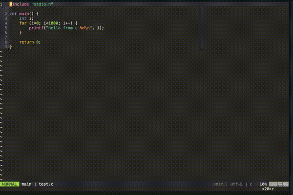

> I require a cutting tool

# About

Vim-terminator runs your current file. Out of the box it comes with support
for 47 languages and can be extended for any vim file type. Using automatic
file type detection, this plugin can

1. Run your current file (or visual selection) in a custom "output buffer"
  - stdout is sent to the output buffer and stderr is sent to the quickfix window
  - The process is executed asynchronously leaving your editor completely functional
  - The process is timed and reported in seconds to 6 decimal places at the end
  of the running job
2. Run your current file (or visual selection) in a vim terminal
  - This allows for running interactive programs (e.g. user input)
3. Start a REPL using the current file type
4. Send parts of the current buffer to a terminal. This includes
  - Visually selected text
  - Text between commented delimiters

# Demo

Run the current file in the output buffer:


Run the current file containing errors for quick fixing:


Run the current file in a terminal:


Send text between delimiters to a REPL:


Automatic window resizing



# Installation

If you use [vim-plug](https://github.com/junegunn/vim-plug)

```vim
plug 'erietz/vim-terminator'
```

*Note:* This plugin requires neovim or vim version >= 8.0

# Usage

| Key map                                     | Description                                                                        |
| ---                                         | ---                                                                                |
| `<leader>ot`                                | Opens (or reopens) a terminal window                                               |
| `<leader>or`                                | Opens a repl                                                                       |
| `<leader>rf`                                | Runs your current file (or visual selection) in the output buffer                  |
| `<leader>rt`                                | Runs your current file (or visual selection) in the terminal                       |
| `<leader>rs`                                | Stops the running job in the output buffer                                         |
| `<leader>rm`                                | Modifies command via command line before running in output buffer                  |
|                                             | **Pro tip: hit `<c-f>` on vims command line to further modify before running**     |
| `<leader>sd`                                | Send text in delimiter to terminal                                                 |
| `<leader>ss`                                | Sends visual selection to terminal                                                 |
| `:TerminatorSendToTerminal echo "hi there"` | Sends `echo "hi there"` to the terminal                                            |


> "I do not like these key bindings, I'd like to set my own"
- Several key mappings are set by default, but they can be removed by adding
`let g:terminator_clear_default_mappings = "foo bar"` to `init.vim` or `.vimrc`
  - If this route is taken, check the file `plugin/terminator.vim` for internal
  functions and commands.

# Extensibility

- Both the commands used to run the current file and to start a REPL for the
current file can be modified via a global dictionary defined in the `init.vim`
or `vimrc` like this

```vim
let g:terminator_runfile_map = {
            \ "javascript": "node",
            \ "python": "python -u",
            \ "c": "gcc $dir$fileName -o $dir$fileNameWithoutExt && $dir$fileNameWithoutExt",
            \ "fortran": "cd $dir && gfortran $fileName -o $fileNameWithoutExt && $dir$fileNameWithoutExt"
            \ }
```

allowing use of the variables defined below

| Variable name            | Description                                                                |
| ---                      | ---                                                                        |
| $fileName                | what you would get from running  `basename` on the file                    |
| $fileNameWithoutExt      | same as $fileName with everything after and including the last `.` removed |
| $dir                     | the full path of the parent directory of the filename                      |
| $dirWithoutTrailingSlash | same as $dir with the trailing slash removed                               |


- The REPL command dictionary is defined similarly

```vim
let g:terminator_repl_command = {
  \'python' : 'ipython --no-autoindent',
  \'javascript': 'node',
  \}
````


## REPL delimiters

- This plugin automatically detects the comment style based on file type.
- By default the delimiters used of the form `In\[.*\]:`
- The delimiters can be modified using the variable `g:terminator_repl_delimiter_regex`
  - For example: you could use `let g:terminator_repl_delimiter_regex = '--'`
  to delimit code blocks. In this example 
    - A python code delimiter would be `# --`
    - A javascript code delimiter would be `// --`
    - etc.

## Managing window splits

Two variables can be set to help manage how windows are split. A combination 
of these variables can go a long way.

1. `let g:terminator_split_fraction = <decimal>` where `<decimal>` is a number between 0 and 1.
2. `let g:terminator_split_location = '<option>'` where `<option>` is something like
  - `belowright`
  - `aboveleft`
  - `topleft`
  - `botright`
  - `vertical belowright`
  - `vertical aboveleft`
  - `vertical topleft`
  - `vertical botright`
  - see `:help vertical` for details of these options

There is also the option `let g:terminator_auto_shrink_output = 1` which
automatically shrinks the output buffer (in a horizontal split) to the size of
the output if it is less than the maximum split size given by
`g:terminator_split_fraction`.

# FAQ

> The quickfix window is populated but I can't jump to the errors

Set the `:compiler` for the file type. This in turn sets `errorformat`. See `:h errorformat`

> The quickfix window is not catching errors after running code of a different file type

Switch to the output buffer and run `:bdelete`. Then run your code again.
