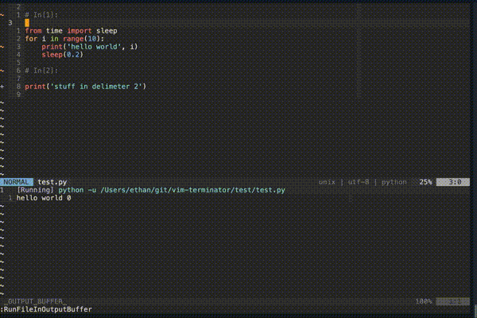
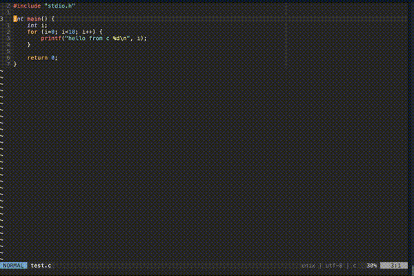
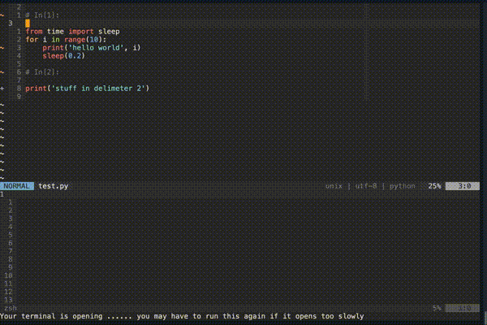
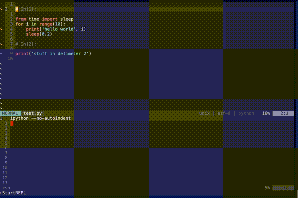

# About

This plugin is all about running your code. Out of the box it comes with
support for 47 languages. Using automatic file type detection, this plugin can

1. Run your current file in a custom "output buffer"
  - stdout is sent to the output buffer and stderr is sent to the quickfix window
  - The process is executed asynchronously leaving your editor completely functional
  - The process is timed and reported in seconds to 6 decimal places at the end
  of the running job
2. Run your current file in a neovim terminal
  - This allows for running interactive programs (e.g. user input)
3. Start a REPL using the current file type
4. Send parts of the current buffer to a terminal. This currently includes
  - Visually selected text
  - Text between commented delimiters

# Demo

Run the current file in the output buffer:



Run the current file containing errors for quick fixing:



Run the current file in a terminal:



Send text between delimiters to a REPL:



# Extensibility

- Both the commands used to run the current file and to start a REPL for the
current file can be modified via a global dictionary defined in the `init.vim`
or `vimrc` like this

```vim
let g:terminator_runfile_map = {
            \ "javascript": "node",
            \ "python": "python -u",
            \ "c": "gcc $dir$fileName -o $dir$fileNameWithoutExt && $dir$fileNameWithoutExt",
            \ "fortran": "cd $dir && gfortran $fileName -o $fileNameWithoutExt && $dir$fileNameWithoutExt"
            \ }
```

allowing use of the variables defined below

| Variable name            | Description                                                                |
| ---                      | ---                                                                        |
| $fileName                | what you would get from running  `basename` on the file                    |
| $fileNameWithoutExt      | same as $fileName with everything after and including the last `.` removed |
| $dir                     | the full path of the parent directory of the filename                      |
| $dirWithoutTrailingSlash | same as $dir with the trailing slash removed                               |


The REPL command dictionary is defined similarly

```vim
let s:terminator_repl_command = {
  \'python' : 'ipython --no-autoindent',
  \'javascript': 'node',
  \}
````

- Several key mappings are set by default, but they can be removed by adding
`let g:terminator_clear_default_mappings = "anything text here"` to `init.vim`
  - If this route is taken, check the file `plugin/terminator.vim` for internal
  functions and commands.

# Installation

Using [vim-plug](https://github.com/junegunn/vim-plug)

```vim
plug 'erietz/vim-terminator'
```

*Note:* This plugin currently works for neovim only

# Usage

| Key map                                     | Description                                                       |
| ---                                         | ---                                                               |
| `<leader>ot`                                | Opens (or reopens) a terminal window                              |
| `<leader>or`                                | Opens a repl                                                      |
| `<leader>rf`                                | Runs your current file (or visual selection) in the output buffer |
| `<leader>rt`                                | Runs your current file (or visual selection) in the terminal      |
| `<leader>rs`                                | Stops the running job in the output buffer                        |
| `<leader>sd`                                | Send text in delimeter to terminal                                |
| `<leader>ss`                                | Sends visual selection to terminal                                |
| `<leader>sf`                                | Runs your entire file in a REPL (only for python)                 |
| `:TerminatorSendToTerminal echo "hi there"` | Sends `echo "hi there"` to the terminal                           |

